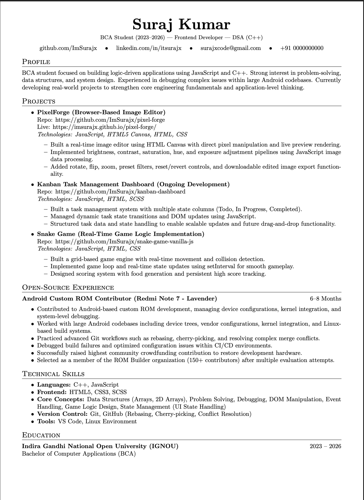

# Resume – Suraj Kumar

This repository contains the LaTeX source code for my professional resume.

  

## 📌 About

- Built using LaTeX
- Version controlled
- Designed for continuous updates as my skills grow
- Compilable using Overleaf or any LaTeX editor

## 🚀 Current Version
v1.0 – Initial structured resume with:
- Technical Skills
- Projects
- Open-Source Experience
- Education

Future versions will include:
- New projects
- Internship experience
- Backend / Full-stack updates
- System design exposure

## 🛠 How to Use

1. Upload `main.tex` to Overleaf
2. Click **Recompile**
3. Modify sections as needed
4. Export as PDF

## 📬 Connect With Me

- GitHub: https://github.com/ImSurajx  
- LinkedIn: https://linkedin.com/in/itsurajx  
- Email: surajxcode@gmail.com  

---

> This repository reflects my growth as an engineer.  
> Each update represents real skill progression.